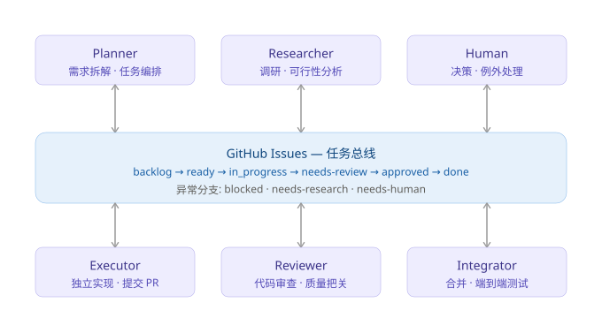
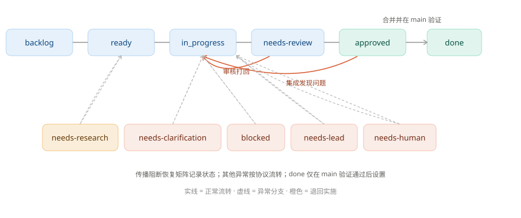
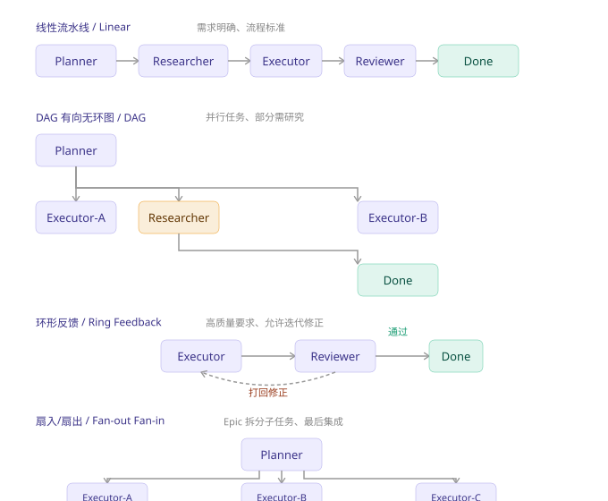

# Multi-Agent Async Workflow

多 Agent 异步协同工作流：用 GitHub Issues 作为任务总线，让不同能力的模型按拓扑结构异步协作，持续流转任务直至闭环。

> 主要贡献者：群友zzszmyf



## 核心模式

这不是 prompt 路由，不是 session 桥连 PRD——而是一个**基于 Issue 的多节点异步协作协议**：

**关键洞察：Issue 在这里不是 bug tracker，是跨 session 的持久化消息队列。每个节点只关心自己负责的状态转换。**

### Issue 状态机



## 节点类型

### Planner（规划侧）

- 需求翻译：把模糊的业务需求拆成可执行的独立 Issue
- 代码阅读：读相关模块，理解现状，找出改动点
- 方案设计：给出实现思路、边界条件、测试要点
- 任务编排：设定优先级、依赖关系、标签分类
- 持续 push：源源不断生成/更新 Issue，维护 backlog

### Researcher（研究侧）

- 信息收集：针对 Issue 中的未知领域做调研
- 方案产出：输出研究结论、可行性分析、竞品对比
- 反馈给 Planner：在 Issue 里 comment 研究结果，或生成新的子 Issue

### Executor（实施侧）

- 独立实现：按 Issue 描述写代码，不改范围
- 提交闭环：提交 PR，关联 Issue，自测通过后推进状态
- 遇到阻塞：在 Issue 里 comment 说明卡点，不自己决策

### Reviewer（审核侧）

- 代码审查：审查 PR，关注正确性、边界条件、测试覆盖
- 批准/打回：通过则关闭 Issue；打回则 comment 具体问题，状态回退
- 质量把关：确保代码符合规范，不引入技术债

### Integrator（集成侧）

- 合并与验证：合并多个相关 PR，确保整体一致
- 端到端测试：运行集成测试、E2E 测试
- 发布协调：与部署/发布流程对接

### Human（真人员工）

- 决策确认：对阻塞/澄清类 Issue 做最终决策
- 质量把关：对高优 Issue 做人工 review
- 边界处理：处理自动化流程无法覆盖的边缘情况

## 流水线拓扑

### 线性流水线

```
Planner → Researcher → Executor → Reviewer → Integrator → Done
```

适用场景：需求明确、流程标准、需要多道质量关卡。

### DAG（有向无环图）

```
Planner
    ├── Issue-A → Executor-A → Reviewer-A
    └── Issue-B → Researcher → Executor-B → Reviewer-B
                ↘
                 Issue-C → Executor-C
```

适用场景：并行任务多、部分任务需要研究、部分可以直接实施。

### 环形反馈

```
Executor → Reviewer → [打回] → Executor
                ↓
            [通过] → Done
```

适用场景：对质量要求高，允许迭代修正。

### 扇入/扇出

```
Planner
    ├── Issue-1 → Executor-A
    ├── Issue-2 → Executor-B
    └── Issue-3 → Executor-C
              ↓
        Integrator（合并）
```

适用场景：一个 Epic 拆成多个子任务，最后需要集成。

### 人工介入点

```
Executor → [阻塞/需确认] → Human → [决策] → Executor
```

适用场景：涉及业务决策、模糊需求、高风险变更。

### 拓扑总览



## 多角色协同扩展

### 多对多（Mesh）

```
Planner-A ─┐
Planner-B ─┤→ Issue Bus ←┬── Executor-A
Planner-C ┘              ├── Executor-B
                          ├── Reviewer-A
                          └── Reviewer-B
```

做法：用标签/里程碑/assignee 区分来源和职责，各节点按规则过滤处理。

### 按领域拆分

```
Planner（技术债） → Executor（后端） → Reviewer（后端）
Planner（业务需求） → Executor（前端） → Reviewer（前端）
Planner（探索） → Researcher → Planner（转成 Issue）
```

做法：不同领域用不同 milestone 或 repo 隔离，避免交叉干扰。

### 质量门控

```
Executor → [自动化 CI] → [通过] → Reviewer → [通过] → Integrator
                ↓                    ↓
             [失败] → Executor    [打回] → Executor
```

做法：CI 状态作为第一个关卡，减少 Reviewer 负担。

## 为什么 Issue 比 PRD 更适合做资产管理

| 维度 | PRD | GitHub Issues |
|------|-----|---------------|
| 结构化程度 | 自由文本，格式不统一 | 模板化，字段固定 |
| 可追踪性 | 文档更新历史，不显式 | 每个 Issue 有独立生命周期 |
| 异步边界 | 弱，需要人解读 | 强，标签/状态/comment 自解释 |
| 并发安全 | 多人编辑冲突 | 天然支持多 Issue 并行 |
| 集成度 | 离代码远 | 原生关联 PR、Commit、CI |
| 搜索/筛选 | 全文搜索 | 标签、milestone、assignee 多维筛选 |
| 成本 | 高（需要维护文档） | 低（Issue 本身就是资产） |

**核心优势：Issue 是代码和需求之间的「标准化接口」。**

## 项目结构

```
multi-agent-workflow/
├── README.md                          # 项目说明（你正在看的这个）
├── SKILL.md                           # WorkBuddy Skill 定义
├── LICENSE                            # MIT License
├── assets/
│   ├── architecture-overview.svg      # 核心架构图
│   ├── issue-state-machine.svg        # Issue 状态机图
│   ├── topology-patterns.svg          # 流水线拓扑图
│   ├── issue-template.md             # Issue 模板（Planner 填写）
│   └── comment-protocol.md           # 各节点 Comment 规范
└── references/
    ├── issue-protocol.md             # 完整协议规范（含标签体系）
    └── best-practices.md             # 落地检查清单与常见坑
```

## 快速开始

1. Fork 本仓库到你的 GitHub 账号
2. 克隆到本地：`git clone git@github.com:<your-org>/multi-agent-workflow.git`
3. 选择一个 repo 作为任务总线，配置 Issue 模板和 Labels
4. 按 `references/best-practices.md` 配置各节点 Session
5. 开始跑第一轮流水线验证

## 资源

- `SKILL.md`：WorkBuddy 可加载的技能定义文件
- `references/issue-protocol.md`：完整协议规范
- `references/best-practices.md`：落地检查清单与常见坑
- `assets/issue-template.md`：可直接复制使用的 Issue 模板
- `assets/comment-protocol.md`：各节点 Comment 规范

## License

MIT
